# Runtime Architecture Diagram

This diagram describes the **current implementation** in this repository: a client-side React SPA driven mostly by mock data and `localStorage`.

For the **planned production target** with Spring Boot, Oracle, S3, React Query, and Zustand, see [ARCHITECTURE.md](../ARCHITECTURE.md).

```mermaid
flowchart TD
  subgraph Browser["Browser / React SPA"]
    App["App.tsx<br/>provider composition + routing"]
    Shell["BrandBanner + LeftRail<br/>global shell, nav, scope switcher, search entry"]

    subgraph SharedState["Shared state and cross-cutting concerns"]
      Localization["LocalizationContext<br/>loads locale packs"]
      Scope["ScopeContext<br/>enterprise/project scope"]
      ViewStyle["ViewStyleContext<br/>appearance + layout"]
      Clipboard["ClipboardContext<br/>saved document clipboard"]
      SearchCtx["SearchContext<br/>last search query"]
      UserPrefs["useUserPref<br/>feature-level UI preferences"]
    end

    subgraph Features["Feature pages"]
      Dashboard["Dashboard<br/>overview + map + activity"]
      Documents["DocumentBrowser<br/>folders + filters + grid/list/table"]
      Search["SearchResults<br/>client-side full-text search"]
      Chat["Chat<br/>mock conversations + scope-aware history"]
      Packages["Packages<br/>package library and workflow prototype"]
      Detail["DocumentDetail<br/>single-document view"]
    end
  end

  subgraph MockData["Client-side data layer"]
    Projects["projects.ts<br/>workspace list + map metadata"]
    Docs["mockDocuments.ts<br/>per-project document corpus"]
    Folders["mockFolders.ts<br/>per-project folder trees"]
    DashboardData["mockDashboard.ts<br/>todos, notifications, activity"]
    SearchData["searchData.ts<br/>search corpus built from docs/folders/placeholders"]
    SearchUtils["utils/search.ts<br/>matching + facet counts"]
  end

  subgraph Persistence["Browser persistence and static assets"]
    LocalStorage["localStorage<br/>scope, clipboard, theme, table prefs, chat/sidebar prefs"]
    Locales["/public/locales/*.json<br/>translation dictionaries"]
  end

  App --> Shell
  App --> Dashboard
  App --> Documents
  App --> Search
  App --> Chat
  App --> Packages
  App --> Detail

  App --> Localization
  App --> Scope
  App --> ViewStyle
  App --> Clipboard
  App --> SearchCtx
  App --> UserPrefs

  Shell --> Scope
  Shell --> SearchCtx
  Shell --> Localization

  Dashboard --> Scope
  Dashboard --> Localization
  Dashboard --> DashboardData
  Dashboard --> Projects
  Dashboard --> Docs

  Documents --> Scope
  Documents --> Localization
  Documents --> Clipboard
  Documents --> UserPrefs
  Documents --> Docs
  Documents --> Folders

  Search --> Scope
  Search --> SearchCtx
  Search --> SearchData
  SearchData --> Docs
  SearchData --> Folders
  Search --> SearchUtils

  Chat --> Scope
  Chat --> Clipboard
  Chat --> Localization
  Chat --> Projects
  Chat --> Docs
  Chat --> UserPrefs

  Packages --> Localization
  Packages -. "inline sample data" .-> Packages

  Detail --> Localization
  Detail --> Docs

  Scope --> LocalStorage
  ViewStyle --> LocalStorage
  Clipboard --> LocalStorage
  UserPrefs --> LocalStorage
  Documents --> LocalStorage
  Localization --> Locales
```

## Reading Guide

- `App.tsx` is the composition root. It wires providers first, then renders the global shell and feature routes.
- Most feature pages read from shared React Context plus centralized mock datasets under `src/data/`.
- The documents feature is the heaviest module and acts as the prototype's center of gravity.
- Search is fully client-side today: `searchData.ts` builds the corpus, and `utils/search.ts` performs matching.
- Persistence is browser-local today. There is no real API-backed state layer yet.
- `WorkspaceContext` was consolidated into `ScopeContext` (2026-07-06); `ScopeContext` is the single source of workspace scope.

## Current Boundary

The current app is still a **UX prototype**, not a production-integrated system:

- No React Query cache layer is active yet.
- No Zustand store is active yet.
- No typed `src/api/` client exists yet.
- The only real fetch in the current runtime is locale JSON loading for localization.
