# Runtime Architecture Diagram

This diagram describes the **current implementation** in this repository: a client-side React SPA whose server data flows over HTTP through React Query hooks, answered by MSW handlers serving the mock datasets through the real API contracts.

For the **planned production target** with Spring Boot, Oracle, S3, and Zustand, see [ARCHITECTURE.md](../ARCHITECTURE.md).

```mermaid
flowchart TD
  subgraph Browser["Browser / React SPA"]
    App["App.tsx<br/>provider composition + routing"]
    Shell["BrandBanner + LeftRail<br/>global shell, nav, scope switcher, search entry"]

    subgraph SharedState["Shared state and cross-cutting concerns"]
      Localization["LocalizationContext<br/>loads locale packs"]
      Scope["ScopeContext<br/>enterprise/project scope"]
      ViewStyle["ViewStyleContext<br/>appearance + layout"]
      Density["DensityContext<br/>compact/comfortable density"]
      Briefcase["BriefcaseContext<br/>user-scoped briefcase<br/>(React Query adapter)"]
      Clipboard["ClipboardContext<br/>saved document clipboard"]
      SearchCtx["SearchContext<br/>last search query"]
      UserPrefs["useUserPref<br/>feature-level UI preferences"]
      Permissions["PermissionContext<br/>AD demo grants: manage/view/none"]
    end

    subgraph Features["Feature pages"]
      Dashboard["Dashboard<br/>overview + map + activity"]
      Documents["DocumentBrowser<br/>folders + filters + grid/list/table"]
      Search["SearchResults<br/>client-side full-text search"]
      Chat["Chat<br/>mock conversations + scope-aware history"]
      MyBriefcase["MyBriefcase<br/>cross-workspace briefcase grid"]
      Packages["Packages<br/>package library and workflow prototype"]
      Detail["DocumentDetail<br/>single-document view"]
      Distribution["AutomaticDistribution<br/>rules + governance tabs"]
      Workgroups["Workgroups<br/>read-only workspace groups"]
    end
  end

  subgraph DataLayer["HTTP data layer (React Query + MSW)"]
    Hooks["src/hooks/<br/>workspace · document · search · distribution queries"]
    Api["src/api/<br/>typed fetch client, endpoints, queryKeys, queryClient"]
    MSW["src/mocks/handlers.ts<br/>MSW mock backend — G03/G05/G06/G19 + briefcase<br/>+ unallocated distribution/workgroups contracts"]
  end

  subgraph MockData["Mock datasets (behind MSW for wired pages)"]
    Projects["projects.ts<br/>workspace list + map metadata"]
    Docs["mockDocuments.ts<br/>per-project document corpus"]
    Folders["mockFolders.ts<br/>per-project folder trees"]
    DashboardData["mockDashboard.ts<br/>todos, notifications, activity"]
    SearchData["searchData.ts<br/>search corpus built from docs/folders/placeholders"]
    SearchUtils["utils/search.ts<br/>matching + facet counts"]
    BriefcaseSeed["briefcaseSeed.ts<br/>demo briefcase items"]
    DistributionSeed["distributionSeed.ts<br/>rule sets + settings + history"]
    WorkgroupsSeed["workgroupsSeed.ts<br/>workspace groups + user directory"]
  end

  subgraph Persistence["Browser persistence and static assets"]
    LocalStorage["localStorage<br/>scope, clipboard, theme, table prefs, chat/sidebar prefs"]
    Locales["/public/locales/*.json<br/>translation dictionaries"]
  end

  App --> Shell
  App --> Dashboard
  App --> Documents
  App --> Search
  App --> Chat
  App --> Packages
  App --> Detail
  App --> Distribution
  App --> Workgroups

  App --> Localization
  App --> Scope
  App --> ViewStyle
  App --> Density
  App --> Briefcase
  App --> Clipboard
  App --> SearchCtx
  App --> UserPrefs
  App --> Permissions

  Shell --> Scope
  Shell --> SearchCtx
  Shell --> Localization

  Dashboard --> Scope
  Dashboard --> Localization
  Dashboard --> DashboardData
  Dashboard --> Projects
  Dashboard --> Docs

  Documents --> Scope
  Documents --> Localization
  Documents --> Clipboard
  Documents --> UserPrefs
  Documents --> Hooks
  Hooks --> Api
  Api -- "fetch /api/v1 (HTTP)" --> MSW
  MSW --> Projects
  MSW --> Docs
  MSW --> Folders
  MSW --> SearchData
  MSW --> SearchUtils
  MSW --> DistributionSeed
  MSW --> WorkgroupsSeed

  Search --> Scope
  Search --> SearchCtx
  Search --> Hooks
  SearchData --> Docs
  SearchData --> Folders

  MyBriefcase --> Briefcase
  Briefcase --> Api
  MSW --> BriefcaseSeed

  Chat --> Scope
  Chat --> Clipboard
  Chat --> Localization
  Chat --> Projects
  Chat --> Docs
  Chat --> UserPrefs

  Packages --> Localization
  Packages -. "inline sample data" .-> Packages

  Detail --> Localization
  Detail --> Docs

  Distribution --> Scope
  Distribution --> Permissions
  Distribution --> Hooks
  Workgroups --> Scope
  Workgroups --> Permissions
  Workgroups --> Hooks

  Scope --> LocalStorage
  ViewStyle --> LocalStorage
  Clipboard --> LocalStorage
  UserPrefs --> LocalStorage
  Permissions --> UserPrefs
  DistributionSeed --> LocalStorage
  Documents --> LocalStorage
  Localization --> Locales
```

## Reading Guide

- `App.tsx` is the composition root. It wires `QueryClientProvider` and the context providers first, then renders the global shell and feature routes. `index.tsx` starts the MSW worker before React renders (skipped when `VITE_API_MODE=real`).
- **DocumentBrowser, SearchResults, Briefcase, Automatic Distribution AD 1/2, and Workgroups are wired to the HTTP data layer**. Automatic Distribution uses provisional, unallocated `/workspaces/{wsId}/distribution/*` and `/workspaces/{wsId}/workgroups` contracts served by MSW; its draft/published/history/settings state persists in browser localStorage.
- Automatic Distribution AD 3 diagnostics and AD 4 runtime evaluation/log/unmatched flows are not implemented. Its production engine remains server-side by design.
- The remaining direct mock consumers (Dashboard, Chat, DocumentDetail, BrandBanner, ProjectMapView) migrate to the same hooks next.
- Persistence of UI state is browser-local (`localStorage`), with cross-window sync via `storage` events (`useUserPref`).
- `WorkspaceContext` was consolidated into `ScopeContext` (2026-07-06); `ScopeContext` is the single source of workspace scope.

## Current Boundary

The prototype now exercises the production API contracts over real HTTP, but is not yet production-integrated:

- MSW answers `/api/v1` from static mock datasets; swap to Spring Boot via `VITE_API_MODE=real` + `VITE_API_BASE_URL` — no component changes.
- No Zustand store is active yet (contexts migrate when auth lands, per ARCHITECTURE.md §State Management).
- No auth: requests carry no JWT; the G01 token flows are design-only (ADR-005).
- `PermissionContext` is a demo-only `ad.manage`/`ad.view` switch. Production grant sourcing and server-side enforcement remain unresolved with G04.
- No G31 real-time event stream yet (ADR-010) — cache invalidation is timer/navigation-driven, not push-driven.
